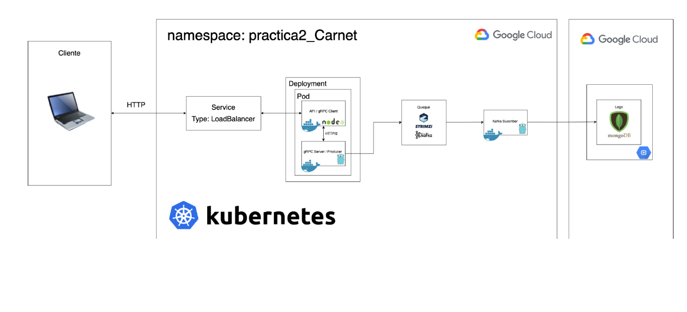

# Práctica #2
* Sistemas Operativos 1
* Erick José André Villatoro Revolorio
* 201900907


## Manual Técnico

El objetivo de la práctica es desplegar una infrastructura de contenedores en Google Cloud Platform, usando Kubernetes. 

### Arquitectura


Como se puede apreciar se utilizó un namespace llamado `practica2_201900907`.
```
kubectl create namespace practica2_201900907
```

### Configuración de gRPC

Para el manejo del tráfico se utilizó un `LoadBalancer Service`. Lo que permite que se utilice como punto de entrada y distribuir el tráfico en las diferentes instancias del nodo. El nodo es del tipo `deployment` y cuenta con dos pods, para el cliente y servidor de gRPC. 

Para la orquestación de gRPC se puede utilizar el archivo [grpc-deployment.yml](./deployment/grpc-deployment.yml).

```
kubectl apply -f grpc-deployment.yml
```

### Cliente gRPC
El [cliente de gRPC](./gRPC-Client/) se encarga de obtener el tráfico del LoabBalancer y redistribuirlo en al servidor. Fue desarrollado por medio de NodeJS y la imágen está almacenada en [Dockerhub](https://hub.docker.com/repository/docker/villa01/grpc_client).

### Server gRPC
El [server de gRPC](./gRPC-Server/) se encarga de recibir el tráfico del cliente y enviarlo al sistema de colas Kafka, entonces actúa como el `producer` de Kafka al mismo tiempo. Fue desarrollado en Go y la imágen se encuentra almacenada en [Dockerhub](https://hub.docker.com/repository/docker/villa01/grpc_server).


### Deploy de Kafka
Para el levantamiento de kafka se utilizó `Strimzi`. En primer lugar se debe utilizar un namespace llamado `kafka`.
```
kubectl create namespace kafka
```

Además se instalaron los archivos de `Strimzi`.
```
kubectl create -f 'https://strimzi.io/install/latest?namespace=kafka' -n kafka
```

Posteriormente se levanta kafka y zookeeper por medio del archivo [kafka-deployment.yml](./deployment/kafka-d.yml).

```
kubectl apply -f kafka-deployment.yml -n kafka 
```

### Kafka Consumer
Esta se encarga de consumir el topic `games-topic` e inserta los logs a una base de datos en MongoDb. Para su despligue se puede utilizar el siguiente documento [kafka-consumer.yml](./deployment/kafka-consumer.yml)

```
kubectl apply -f kafka-consumer.yml
```

El `consumer` de kafka fue desarrollado en Go y se encuentra almacenado en [Dockerhub](https://hub.docker.com/repository/docker/villa01/kafka-consumer). 


## Manual de Usuario

A continuación se provee instrucciones para utilizar la aplicación. Esta misma cuenta con 2 endpoints para su funcionamiento. 

### Endpoints

| Ruta | Tipo | Función |
|------|------|---------|
|/| GET | Permite verificar el funcionamiento de la aplicación.
| /sendGame | POST | Se utiliza para enviar información de los juegos y jugadores y detonar los juegos, además del almacenamiento de registros y datos. 


### Hello World
Esta ruta provee un nombre para la petición que se está realizando y un mensaje para verificar el funcionamiento de la aplicación. La respuesta esperada es: 
```
{

    "name": "Lark Newhall",
    "msg": "Hello World"

}
```

### Send Game
La ruta espera un cuerpo de petición con la siguiente estructura
```
{
    "game_id":10,
    "players":20
}
```
El parámetro `game_id` y `players` son de caracter obligatorio. 